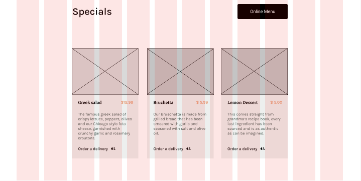

# Meta Front-End Developer Professional Capstone

## Overview
This project is the capstone learning project from the Meta Front-End Professional Developer specialization taken on Coursera.org.  
The specialization was composed of 9 classes including HTML/CSS, VCS, JavaScript, React, Advanced React, UI/UX, Capstone, and others.

## 

